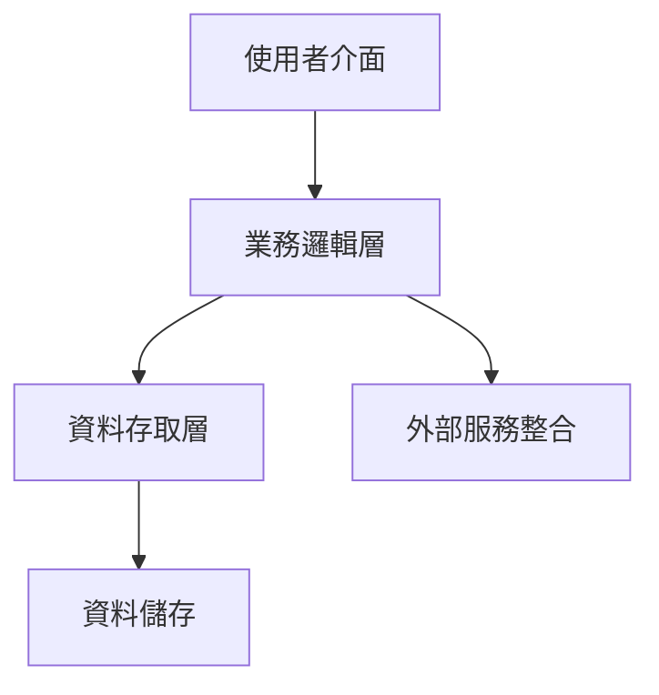

# GitHub Issue 分析指令

## 🎯 目標
深入分析 GitHub Issue，提取完整需求，產生可執行的技術規格。

## 📋 分析流程

### 1. Issue 內容解析
```markdown
分析項目：
- [ ] 問題標題和標籤
- [ ] 問題描述和背景
- [ ] 使用者故事和場景
- [ ] 預期結果和驗收標準
- [ ] 技術限制和約束
- [ ] 相關 Issue 和 PR
```

### 2. 需求分類
```yaml
功能需求:
  - 核心功能點
  - 使用者互動流程
  - 資料處理邏輯
  - 整合需求

非功能需求:
  - 效能指標
  - 安全要求
  - 可用性標準
  - 相容性需求
```

### 3. 技術評估

#### 複雜度分析
```javascript
const complexityFactors = {
  uiComplexity: 'low|medium|high',
  logicComplexity: 'low|medium|high',
  dataComplexity: 'low|medium|high',
  integrationComplexity: 'low|medium|high',
  testingComplexity: 'low|medium|high'
};
```

#### 風險識別
- **技術風險**：新技術學習曲線、第三方相依性
- **時程風險**：開發時間估算、相依任務
- **品質風險**：測試覆蓋度、迴歸測試需求

### 4. 解決方案設計

#### 架構建議


#### 技術選型
- **前端框架**：根據專案現有技術棧
- **狀態管理**：簡單/複雜場景的不同方案
- **資料流**：單向/雙向資料綁定
- **測試策略**：單元/整合/E2E 測試

### 5. 實作計畫

#### 開發階段
1. **準備階段** (10%)
   - 環境設定
   - 相依性安裝
   - 基礎架構搭建

2. **核心開發** (60%)
   - UI 元件開發
   - 業務邏輯實作
   - 資料模型設計
   - API 整合

3. **測試階段** (20%)
   - 單元測試撰寫
   - 整合測試
   - 使用者測試

4. **優化階段** (10%)
   - 效能優化
   - 程式碼重構
   - 文件完善

### 6. 產出物規格

#### 必要產出
- [ ] 功能實作程式碼
- [ ] 單元測試
- [ ] API 文件
- [ ] 使用指南
- [ ] 部署說明

#### 可選產出
- [ ] 效能測試報告
- [ ] 安全評估報告
- [ ] 架構決策記錄
- [ ] 技術債清單

## 📊 分析報告模板

```markdown
# Issue #[編號] 分析報告

## 需求摘要
[一段話說明核心需求]

## 使用者價值
- 解決的問題：
- 帶來的好處：
- 影響的使用者：

## 技術方案

### 方案概述
[技術實作的高階描述]

### 關鍵技術點
1. [技術點1]：[說明]
2. [技術點2]：[說明]
3. [技術點3]：[說明]

### 實作步驟
1. [ ] 步驟1
2. [ ] 步驟2
3. [ ] 步驟3

### 預估工時
- 開發：[X]小時
- 測試：[X]小時
- 文件：[X]小時

## 風險與緩解
| 風險 | 影響 | 緩解措施 |
|------|------|----------|
| [風險1] | [影響程度] | [措施] |

## 驗收標準
- [ ] 標準1
- [ ] 標準2
- [ ] 標準3

## 相關資源
- 參考文件：
- 相似實作：
- 技術文章：
```

## 🔍 深度分析技巧

### 需求挖掘
- **5W1H 分析法**：What, Why, Who, When, Where, How
- **場景模擬**：設想各種使用情境
- **邊界思考**：極端情況和異常處理

### 優先級判定
```javascript
const priorityMatrix = {
  impact: 'high|medium|low',
  effort: 'high|medium|low',
  value: 'high|medium|low',
  urgency: 'high|medium|low'
};

// 優先級計算
function calculatePriority(matrix) {
  // 高影響 + 低成本 = 最高優先級
  // 低影響 + 高成本 = 最低優先級
}
```

### 相依性分析
- **上游相依**：需要等待的前置條件
- **下游影響**：會影響的後續功能
- **橫向關聯**：相關但不直接相依的功能

## 💡 最佳實踐

### DO's ✅
- 主動詢問不明確的需求細節
- 考慮現有系統的整合點
- 預留擴展性和維護性空間
- 提供多個方案供選擇
- 明確定義完成標準

### DON'Ts ❌
- 不要假設需求細節
- 不要忽略非功能需求
- 不要過度設計
- 不要忽視使用者體驗
- 不要跳過風險評估

## 🚀 自動化提示

當分析 Issue 時，Agent 應該：
1. 自動提取關鍵資訊
2. 識別隱含的需求
3. 建議最佳技術方案
4. 產生完整的分析報告
5. 準備後續的 UC 文件框架

---

**記住**：優秀的需求分析是成功專案的基石。花時間深入理解需求，比急於開始編碼更加重要。